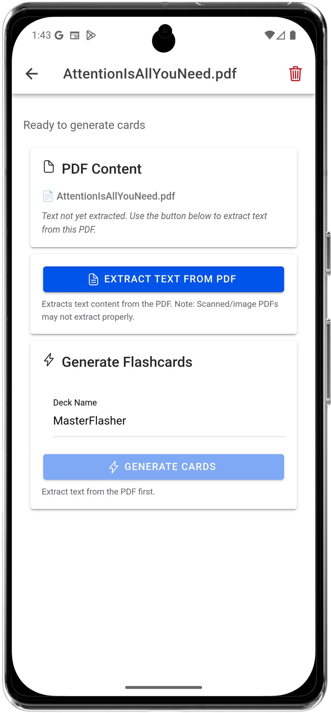
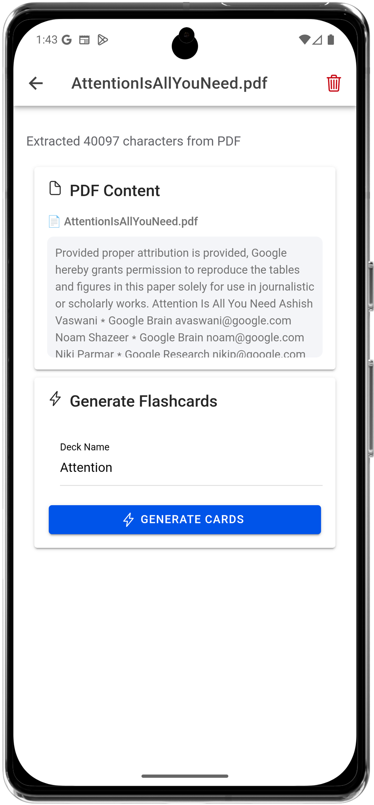
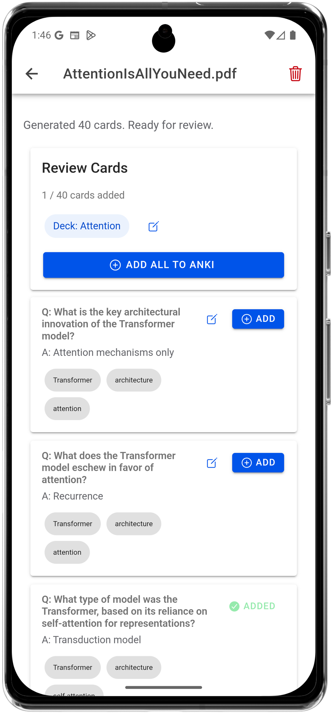

<p align="center">
  
</p>

<h1 align="center">MasterFlasher</h1>

MasterFlasher is an Android app that converts shared text, URLs, local PDF files, or voice input into AnkiDroid flashcards using Gemini.

Content shared from any app is silently saved to an inbox. Users later extract readable text (for URLs and PDFs), generate flashcards, review them, and add selected cards to AnkiDroid.

<p align="center">
  
  
  
</p>

---

## Installation

Download the latest APK from the GitHub Releases page:

1. Go to the [latest release](https://github.com/mortsnort/MasterFlasher/releases/latest)
2. Download the `.apk` file under **Assets**
3. Open the APK on your Android device to install
4. Enable **Install from unknown sources** if prompted

> **Note**: This app requires [AnkiDroid](https://play.google.com/store/apps/details?id=com.ichi2.anki) to be installed on the device.

---

## How MasterFlasher Works
_This section defines the complete end-to-end behavior of the app._

1. **Input**
   - Content enters the app via Android Share (text, URL, PDF) or via in-app voice dictation.
   - Share actions are silent: the UI does not open.

2. **Inbox Persistence**
   - Each input is stored as an inbox entry in a local Room-backed SQLite database.
   - A toast confirms successful save.

3. **Content Extraction**
   - URLs: Opens an in-app browser; when the user taps **Extract to Anki**, injected JavaScript (Readability) extracts the page’s readable article text.
   - PDFs: Users share a local PDF file (e.g., from a file manager) to MasterFlasher; the file reference is saved to the inbox and text is extracted on demand using pdf.js.
   - Plain text and voice input require no extraction.

4. **Card Generation**
   - Extracted text is sent to Gemini for flashcard generation.
   - Gemini responses are required to be strict JSON.
   - Users may configure a custom deck name per entry.

5. **Review & Commit**
   - Cards are reviewed individually.
   - Accepted cards are inserted into AnkiDroid.
   - Decks and note models are created automatically if they do not exist.

6. **Lifecycle Cleanup**
   - Once all generated cards are added, the inbox entry is automatically deleted.


---

## Capabilities

### Inputs
- Android Share: text, URLs, PDFs
- In-app voice dictation

### Extraction
- Readability-based article extraction for URLs
- pdf.js text extraction for PDFs

### AI
- Gemini-powered fact extraction and flashcard generation
- User-editable prompts
- Strict JSON schema validation

### AnkiDroid Integration
- Deck creation
- Note model creation (`com.snortstudios.masterflasher`)
- Direct note insertion

### UX
- Silent share handling
- Inbox-based deferred processing
- Manual per-card review
- Automatic entry cleanup

---

## UI Notes

- Inbox supports pull-to-refresh.
- Swipe left on an entry to delete it.
- Entries with generated cards display a lock icon and **Cards Ready** badge.

---

### Voice Input UI

- Tap the microphone button (🎤) to dictate text.
- Speech is transcribed live.
- Users may edit the transcription before saving it to the inbox.

---

## User-Editable Prompts

MasterFlasher allows users to customize the prompts sent to Gemini for fact extraction and flashcard generation without modifying app code.

---

## Bring Your Own Key (BYOK)

MasterFlasher operates on a **Bring Your Own Key (BYOK)** model.

- Users supply their own Gemini API key.
- No API keys are bundled with the app.
- All AI requests are made directly from the device using the user’s key.
- Each card generation involves multiple Gemini API calls as part of a quality-focused pipeline.

This ensures:
- User ownership of API usage and quotas
- No shared keys
- No server-side proxying

---

## API Key Storage & Security

- API keys are stored **only on the device**.
- Keys are encrypted and persisted using **Android KeyStore–backed secure storage**.
- Keys are never logged, transmitted to third-party servers, or stored in plaintext.

---

## Project Structure

- `src/pages/InboxScreen.tsx`  
  Main inbox screen and voice input FAB

- `src/pages/EntryDetailScreen.tsx`  
  Content extraction, card generation, and review UI

- `src/pages/SettingsScreen.tsx`  
  API key and model configuration

- `src/plugins/Inbox.ts`  
  Inbox database plugin interface

- `src/plugins/SpeechRecognition.ts`  
  Native speech recognition wrapper

- `src/hooks/useSpeechRecognition.ts`  
  Speech recognition hook

- `src/lib/gemini/`  
  Gemini prompts, schemas, and response parsing

- `android/app/src/main/java/com/snortstudios/masterflasher/db/`  
  Room entities and DAOs

- `android/app/src/main/java/com/snortstudios/masterflasher/plugins`  
  Native Capacitor plugins

---

## Build Requirements

- Node.js + npm
- Android Studio (for emulator or device builds)
- AnkiDroid installed on the target device
- Gemini API key

---

## Setup (Development)

1. Install dependencies
   ```bash
   npm install
   ```

2. Configure environment (Development only)
   Create a `.env` file in the repository root:
   ```env
   VITE_GEMINI_API_KEY=your_gemini_api_key_here
   VITE_GEMINI_MODEL_NAME=gemini-2.5-flash-lite
   ```
   
   > **Note**: In production, users configure their own API key via the Settings screen. The `.env` file is only needed for development.

3. Sync Capacitor
   ```bash
   npx cap sync android
   ```

4. Run on Android
   ```bash
   npx cap run android
   ```
   Or open Android Studio:
   ```bash
   npx cap open android
   ```
   
## Configuration Notes

- Default deck name is `MasterFlasher` (customizable per entry).
- Model key used for cards is `com.snortstudios.masterflasher`.
- Gemini output is expected to be strict JSON; failures will surface in the UI log.
- Default Gemini model is `gemini-2.5-flash-lite` when not specified.
- Generated cards and entries are stored in a local SQLite database.

### Gemini Generation Pipeline

Each card generation uses multiple Gemini API calls:

1. **Fact Extraction**  
   The source text is analyzed to produce a list of candidate atomic facts.

2. **Fact Scoring & Filtering**  
   The fact list is scored for usefulness and relevance; low-quality or redundant facts are filtered out.

3. **Flashcard Generation**  
   The remaining facts are converted into question–answer flashcards.

## API Key Configuration

### Development Mode
Uses `.env` file variables (`VITE_GEMINI_API_KEY`, `VITE_GEMINI_MODEL_NAME`).

### Production Mode
Users configure their own Gemini API key via the in-app Settings screen:
1. Tap the settings icon (⚙️) in the header
2. Enter your Gemini API key (get one free from [Google AI Studio](https://aistudio.google.com/app/apikey))
3. Optionally specify a different Gemini model
4. Tap "Save Settings"

API keys are stored securely using platform-native encryption (Android KeyStore).

## Troubleshooting

- "Gemini API Key not configured": In production, open Settings to enter your API key. In development, check `.env` and restart the dev server/build.
- "AnkiDroid not available": ensure AnkiDroid is installed and the API is enabled.
- Share does nothing: confirm the app is installed and chosen as a share target.

## License

This project is licensed under the  
**Creative Commons Attribution-NonCommercial 4.0 International (CC BY-NC 4.0)**.

- ✅ Free to use, modify, and share for **non-commercial** purposes
- ❌ Commercial use is **not permitted** without permission

See the [LICENSE](./LICENSE) file for details.
