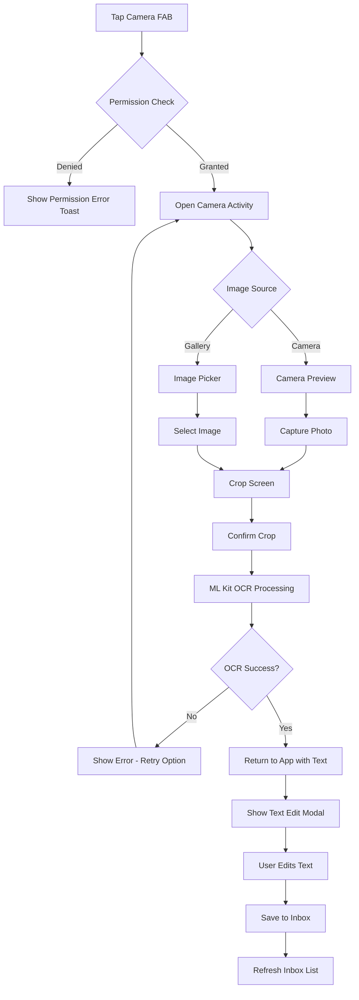

# Camera OCR Feature Plan

## Purpose

Add a camera button (FAB) next to the existing microphone FAB on the InboxScreen to capture text from images using ML Kit OCR. Primary use case is extracting text from physical book pages for flashcard creation.

## User Flow



## Architecture Overview

### Components

```
┌─────────────────────────────────────────────────────────────────┐
│                        TypeScript Layer                          │
├─────────────────────────────────────────────────────────────────┤
│  InboxScreen.tsx                                                │
│  ├── Camera FAB (next to Mic FAB)                               │
│  └── OCR Text Edit Modal (reuse speech modal pattern)           │
│                                                                 │
│  useCameraOCR.ts (hook)                                         │
│  ├── State: isAvailable, isProcessing, extractedText, error     │
│  └── Actions: openCamera, requestPermission, reset              │
│                                                                 │
│  CameraOCR.ts (plugin wrapper)                                  │
│  └── Methods: checkPermissions, requestPermissions, captureOCR  │
└─────────────────────────────────────────────────────────────────┘
                              │
                              ▼
┌─────────────────────────────────────────────────────────────────┐
│                        Native Android Layer                      │
├─────────────────────────────────────────────────────────────────┤
│  CameraOCRPlugin.java (Capacitor Plugin)                        │
│  ├── @PluginMethod checkPermissions()                           │
│  ├── @PluginMethod requestPermissions()                         │
│  └── @PluginMethod captureOCR() → starts CameraOCRActivity      │
│                                                                 │
│  CameraOCRActivity.java                                         │
│  ├── CameraX Preview + ImageCapture                             │
│  ├── Gallery picker option                                      │
│  ├── UCrop integration for cropping                             │
│  └── ML Kit TextRecognition processing                          │
└─────────────────────────────────────────────────────────────────┘
```

## Key Files to Create/Modify

### New Files

| File | Purpose |
|------|---------|
| `android/app/src/main/java/com/snortstudios/masterflasher/plugins/CameraOCRPlugin.java` | Capacitor plugin for camera OCR |
| `android/app/src/main/java/com/snortstudios/masterflasher/plugins/CameraOCRActivity.java` | Full-screen camera activity with CameraX |
| `android/app/src/main/res/layout/activity_camera_ocr.xml` | Layout for camera activity |
| `src/plugins/CameraOCR.ts` | TypeScript plugin wrapper |
| `src/hooks/useCameraOCR.ts` | React hook for camera OCR state management |
| `docs/camera-ocr.md` | Feature documentation |

### Files to Modify

| File | Changes |
|------|---------|
| `android/app/build.gradle` | Add CameraX, ML Kit, UCrop dependencies |
| `android/app/src/main/AndroidManifest.xml` | Add CAMERA permission, CameraOCRActivity registration |
| `android/app/src/main/java/com/snortstudios/masterflasher/MainActivity.java` | Register CameraOCRPlugin |
| `src/pages/InboxScreen.tsx` | Add camera FAB, OCR text edit modal |

## Dependencies

### Android Dependencies (build.gradle)

```groovy
dependencies {
    // Existing dependencies...
    
    // CameraX 1.5.2
    def camerax_version = "1.5.2"
    implementation "androidx.camera:camera-core:${camerax_version}"
    implementation "androidx.camera:camera-camera2:${camerax_version}"
    implementation "androidx.camera:camera-lifecycle:${camerax_version}"
    implementation "androidx.camera:camera-view:${camerax_version}"
    
    // ML Kit Text Recognition (bundled - ~4MB increase per architecture)
    implementation 'com.google.mlkit:text-recognition:16.0.1'
    
    // UCrop for image cropping
    implementation 'com.github.yalantis:ucrop:2.2.11'
    
    // Material Components (for FAB, buttons in camera UI)
    implementation 'com.google.android.material:material:1.11.0'
}
```

**Note on CameraX Version**: User requested 1.5.2, but the latest stable is 1.5.0-alpha03. Will use this as it provides the features needed. If a stable 1.5.x is preferred, can fall back to 1.4.x stable.

### Android Permissions (AndroidManifest.xml)

```xml
<!-- Camera permission for capturing images -->
<uses-permission android:name="android.permission.CAMERA" />

<!-- For gallery access on older Android versions -->
<uses-permission android:name="android.permission.READ_EXTERNAL_STORAGE" 
    android:maxSdkVersion="32" />

<!-- For Android 13+ photo picker -->
<uses-permission android:name="android.permission.READ_MEDIA_IMAGES" />

<!-- Camera feature declaration -->
<uses-feature android:name="android.hardware.camera" android:required="false" />
```

## Implementation Details

### 1. CameraOCRPlugin.java

```java
@CapacitorPlugin(
    name = "CameraOCR",
    permissions = {
        @Permission(
            strings = { Manifest.permission.CAMERA },
            alias = "camera"
        )
    }
)
public class CameraOCRPlugin extends Plugin {
    
    private static final int REQUEST_CAMERA_OCR = 1001;
    
    @PluginMethod
    public void checkPermissions(PluginCall call) {
        // Return current permission status
    }
    
    @PluginMethod
    public void requestPermissions(PluginCall call) {
        // Request camera permission
    }
    
    @PluginMethod
    public void captureOCR(PluginCall call) {
        // Launch CameraOCRActivity
        // Handle result via onActivityResult
    }
    
    @Override
    protected void handleOnActivityResult(int requestCode, int resultCode, Intent data) {
        // Process OCR result and return to JS
    }
}
```

### 2. CameraOCRActivity.java

Key responsibilities:
- **CameraX Setup**: Initialize camera preview with PreviewView
- **Image Capture**: Take photo using ImageCapture use case
- **Gallery Picker**: Launch system image picker for existing photos
- **Cropping**: Launch UCrop activity for image cropping
- **OCR Processing**: Use ML Kit TextRecognizer on cropped image
- **Result Return**: Pass extracted text back to plugin via Intent result

```java
public class CameraOCRActivity extends AppCompatActivity {
    
    private PreviewView previewView;
    private ImageCapture imageCapture;
    private TextRecognizer textRecognizer;
    
    @Override
    protected void onCreate(Bundle savedInstanceState) {
        // Setup UI with camera preview
        // Initialize CameraX
        // Initialize ML Kit TextRecognizer
    }
    
    private void startCamera() {
        // Bind CameraX use cases (Preview, ImageCapture)
    }
    
    private void capturePhoto() {
        // Capture image and launch crop activity
    }
    
    private void openGallery() {
        // Launch image picker intent
    }
    
    private void processImageWithOCR(Uri imageUri) {
        // Use ML Kit to extract text
        // Return result to calling activity
    }
}
```

### 3. ML Kit Integration

```java
// Initialize recognizer (Latin script for English)
TextRecognizer recognizer = TextRecognition.getClient(TextRecognizerOptions.DEFAULT_OPTIONS);

// Process image
InputImage image = InputImage.fromFilePath(context, croppedImageUri);

recognizer.process(image)
    .addOnSuccessListener(visionText -> {
        String extractedText = visionText.getText();
        // Return text to plugin
    })
    .addOnFailureListener(e -> {
        // Handle error
    });
```

### 4. TypeScript Plugin Wrapper (CameraOCR.ts)

```typescript
export interface CameraOCRResult {
    text: string;
    cancelled: boolean;
}

export interface PermissionStatus {
    camera: PermissionState;
}

const CameraOCR = {
    checkPermissions: (): Promise<PermissionStatus> => {...},
    requestPermissions: (): Promise<PermissionStatus> => {...},
    captureOCR: (): Promise<CameraOCRResult> => {...},
};

export default CameraOCR;
```

### 5. useCameraOCR Hook

```typescript
export function useCameraOCR(): UseCameraOCRReturn {
    const [isAvailable, setIsAvailable] = useState(true);
    const [isProcessing, setIsProcessing] = useState(false);
    const [extractedText, setExtractedText] = useState('');
    const [error, setError] = useState<string | null>(null);
    const [permissionStatus, setPermissionStatus] = useState<PermissionState | null>(null);
    
    const openCamera = useCallback(async () => {
        // Check/request permissions
        // Call CameraOCR.captureOCR()
        // Update state with result
    }, []);
    
    return {
        isAvailable,
        isProcessing,
        extractedText,
        error,
        permissionStatus,
        openCamera,
        requestPermission,
        reset,
    };
}
```

### 6. InboxScreen Updates

```tsx
// Two FABs side by side at bottom center
<div style={{ 
    position: 'fixed', 
    bottom: 24, 
    left: '50%', 
    transform: 'translateX(-50%)',
    display: 'flex',
    gap: 16,
}}>
    {/* Camera FAB */}
    <IonFabButton onClick={handleCameraFabClick} color="secondary">
        <IonIcon icon={cameraOutline} />
    </IonFabButton>
    
    {/* Microphone FAB */}
    <IonFabButton onClick={handleSpeechFabClick} color="primary">
        <IonIcon icon={micOutline} />
    </IonFabButton>
</div>

{/* Reuse modal pattern for OCR text editing */}
<IonModal isOpen={showOCRModal} ...>
    {/* Similar to speech modal - show extracted text, allow editing, save */}
</IonModal>
```

## UI/UX Design

### Camera Activity Layout

```
┌─────────────────────────────────────┐
│  ← Back                    Gallery  │  ← Top bar with back and gallery buttons
├─────────────────────────────────────┤
│                                     │
│                                     │
│         Camera Preview              │  ← Full-screen CameraX PreviewView
│         (PreviewView)               │
│                                     │
│                                     │
├─────────────────────────────────────┤
│            ┌───────┐                │
│            │   ●   │                │  ← Circular capture button
│            └───────┘                │
│    Tap to capture photo             │
└─────────────────────────────────────┘
```

### Crop Screen (UCrop)

```
┌─────────────────────────────────────┐
│  Cancel              ✓ Done         │
├─────────────────────────────────────┤
│  ┌─────────────────────────────┐    │
│  │                             │    │
│  │   Cropped Region            │    │  ← Draggable crop area
│  │   (user adjustable)         │    │
│  │                             │    │
│  └─────────────────────────────┘    │
│                                     │
│  [Rotate] [Aspect Ratio] [Reset]    │  ← UCrop tools
└─────────────────────────────────────┘
```

### InboxScreen with Dual FABs

```
┌─────────────────────────────────────┐
│  MasterFlasher              ⚙️      │
├─────────────────────────────────────┤
│                                     │
│  Inbox entries list...              │
│                                     │
│                                     │
│                                     │
│                                     │
│                                     │
│          📷      🎤                 │  ← Dual FABs: Camera (secondary) + Mic (primary)
└─────────────────────────────────────┘
```

## Error Handling

| Scenario | Handling |
|----------|----------|
| Camera not available | Hide camera FAB, show toast if user somehow triggers |
| Permission denied | Show toast explaining permission needed |
| Camera in use by other app | Show error toast, retry option |
| OCR extraction fails | Show error in activity, allow retry |
| No text detected | Show message "No text found in image", allow retry |
| User cancels at any step | Return to inbox gracefully, no entry created |

## Testing Checklist

- [ ] Camera permission request flow
- [ ] Camera capture on various devices
- [ ] Gallery image selection
- [ ] Image cropping with rotation
- [ ] OCR on clear book text
- [ ] OCR on handwritten text (expected: lower accuracy)
- [ ] OCR on low-light images
- [ ] Text editing in modal
- [ ] Save to inbox flow
- [ ] Error handling for all failure cases
- [ ] Memory management (releasing camera/ML Kit resources)
- [ ] Back button behavior at each step

## Performance Considerations

1. **App Size**: ML Kit bundled model adds ~4MB per architecture. Consider unbundled option if size is critical.
2. **Memory**: Release CameraX and ML Kit resources when activity finishes
3. **Image Resolution**: Capture at reasonable resolution (1080p) - higher doesn't improve OCR significantly
4. **Processing Time**: Show loading indicator during OCR processing

## Future Enhancements

- [ ] Multi-language OCR support (Chinese, Japanese, Korean, Devanagari)
- [ ] Batch capture mode (multiple pages)
- [ ] Auto-crop detection for book pages
- [ ] Document edge detection
- [ ] OCR confidence display
- [ ] Save original image with entry
