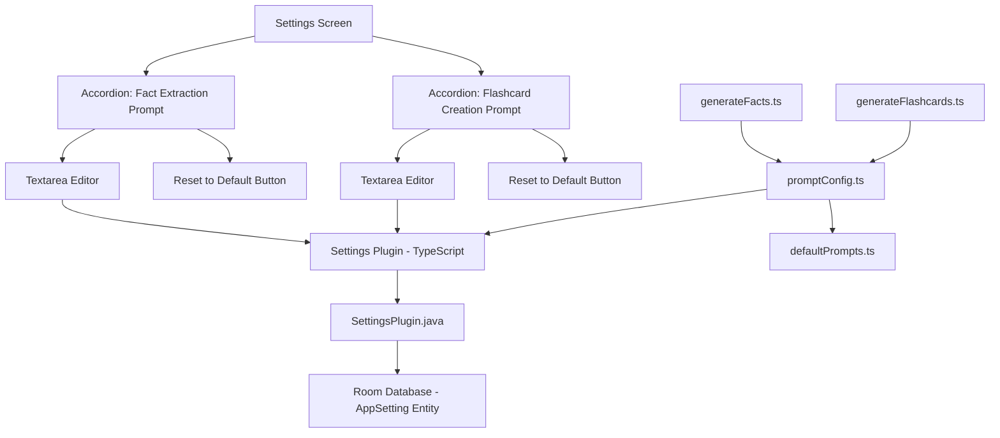

# Custom Prompts Feature Plan

## Purpose

Allow users to customize the fact extraction and flashcard creation prompts in the Settings menu, with the ability to reset to defaults.

## Architecture Overview



## Key Files to Create/Modify

### New Files - Native Android

1. **`android/.../db/AppSetting.java`**
   - Room entity for key-value settings storage
   - Fields: `key` (String, primary key), `value` (String)

2. **`android/.../plugins/SettingsPlugin.java`**
   - Capacitor plugin to expose settings operations to TypeScript
   - Methods: `getSetting()`, `setSetting()`, `deleteSetting()`

### New Files - TypeScript

3. **`src/plugins/Settings.ts`**
   - TypeScript interface for the Settings Capacitor plugin
   - Type-safe methods matching the Java plugin

4. **`src/lib/settings/defaultPrompts.ts`**
   - Export default prompt constants for fact extraction and flashcard creation
   - These serve as defaults and reset values

5. **`src/lib/settings/promptConfig.ts`**
   - Functions to get/set custom prompts via Settings plugin
   - Fallback to defaults when no custom prompt is stored

### Files to Modify - Native Android

6. **`android/.../db/AppDatabase.java`**
   - Add `AppSetting` entity to the database
   - Bump database version from 1 to 2
   - Add migration strategy

7. **`android/.../db/InboxDao.java`**
   - Add setting-related queries or create separate SettingsDao

8. **`android/.../MainActivity.java`**
   - Register the new SettingsPlugin

### Files to Modify - TypeScript

9. **`src/lib/gemini/generateFacts.ts`**
   - Import prompt from promptConfig instead of hardcoding
   - Construct final prompt by combining customizable instructions with dynamic content

10. **`src/lib/gemini/generateFlashcards.ts`**
    - Import prompt from promptConfig instead of hardcoding
    - Construct final prompt by combining customizable instructions with dynamic content

11. **`src/pages/SettingsScreen.tsx`**
    - Add two `IonAccordion` sections for prompt customization
    - Each section contains:
      - `IonTextarea` for editing the prompt
      - Reset button to restore default
    - Load custom prompts on mount using Settings plugin
    - Save prompts as part of the existing save flow

## Implementation Details

### Room Database Schema

**AppSetting Entity:**
```java
@Entity(tableName = "app_settings")
public class AppSetting {
    @PrimaryKey
    @NonNull
    public String key;
    
    public String value;
}
```

**Storage Keys:**
```
fact_extraction_prompt    - Custom fact extraction instructions
flashcard_creation_prompt - Custom flashcard creation instructions
```

### Database Migration

```java
// Migration from version 1 to 2 - adds app_settings table
static final Migration MIGRATION_1_2 = new Migration(1, 2) {
    @Override
    public void migrate(SupportSQLiteDatabase database) {
        database.execSQL(
            "CREATE TABLE IF NOT EXISTS app_settings (" +
            "key TEXT PRIMARY KEY NOT NULL, " +
            "value TEXT)"
        );
    }
};
```

### Default Prompts Structure

The prompts will be split into customizable instruction portions:

**Fact Extraction Prompt Instructions (customizable):**
```
Extract explicit, relevant key concepts stated in the text.

Constraints:
1. Extract up to 10 of the most important key concepts (maximum 10).
2. Each key concept must be a single declarative sentence.
3. Maximum length per key concept: 240 characters.
4. No inference or interpretation - only explicit concepts from the source material.
5. Prioritize the most significant and unique concepts.
```

**Dynamic content appended at runtime (not customizable):**
```
Context/Title: ${title}
Text:
${text}
```

**Flashcard Creation Prompt Instructions (customizable):**
```
Using these concepts, generate a flash card for each concept.
Front should be a clear question/prompt; back is the answer.
Add 1-4 short tags.
Deck Name: MasterFlasher
```

**Dynamic content appended at runtime (not customizable):**
```
Concepts:
${factsJson}
```

### Settings Plugin Interface

**TypeScript Interface (src/plugins/Settings.ts):**
```typescript
export interface SettingsPlugin {
  getSetting(options: { key: string }): Promise<{ value: string | null }>;
  setSetting(options: { key: string; value: string }): Promise<void>;
  deleteSetting(options: { key: string }): Promise<void>;
}

const Settings = registerPlugin<SettingsPlugin>('Settings');
export default Settings;
```

**Java Plugin Methods:**
```java
@PluginMethod
public void getSetting(PluginCall call) { ... }

@PluginMethod
public void setSetting(PluginCall call) { ... }

@PluginMethod
public void deleteSetting(PluginCall call) { ... }
```

### Settings Screen UI Changes

The settings screen will have two new collapsible sections below the existing API configuration:

```
┌─────────────────────────────────────────┐
│ ⚙️ Gemini API Configuration            │
│   [API Key field]                       │
│   [Model Name field]                    │
├─────────────────────────────────────────┤
│ ▶ Fact Extraction Prompt               │  <- Collapsed by default
│   [Tap to expand]                       │
├─────────────────────────────────────────┤
│ ▶ Flashcard Creation Prompt            │  <- Collapsed by default
│   [Tap to expand]                       │
├─────────────────────────────────────────┤
│ [Save Settings]                         │
│ [Clear Settings]                        │
└─────────────────────────────────────────┘
```

When expanded:
```
┌─────────────────────────────────────────┐
│ ▼ Fact Extraction Prompt               │
│ ┌─────────────────────────────────────┐ │
│ │ Extract explicit, relevant key      │ │
│ │ concepts stated in the text.        │ │
│ │                                     │ │
│ │ Constraints:                        │ │
│ │ 1. Extract up to 10 of the most...  │ │
│ └─────────────────────────────────────┘ │
│ [🔄 Reset to Default]                   │
├─────────────────────────────────────────┤
```

## Data Flow

### Saving Custom Prompts

1. User edits prompt in textarea
2. User clicks Save Settings
3. `handleSave()` calls Settings plugin `setSetting()` for each prompt
4. SettingsPlugin.java inserts/updates the AppSetting entity in Room
5. Room persists to SQLite database

### Using Custom Prompts

1. `generateFacts()` calls `getFactExtractionPrompt()` from promptConfig.ts
2. promptConfig calls Settings plugin `getSetting({ key: 'fact_extraction_prompt' })`
3. SettingsPlugin queries Room database for the setting
4. Returns custom prompt if exists, otherwise promptConfig returns default
5. `generateFacts()` combines instructions with dynamic content

### Resetting Prompts

1. User clicks Reset to Default button
2. Updates textarea to show default prompt value
3. On save, either:
   - Stores the default value explicitly, OR
   - Calls `deleteSetting()` to remove the custom entry (cleaner)

## Edge Cases

- **Empty prompt**: If user clears the prompt completely, fall back to default
- **Invalid prompt**: No validation needed - Gemini will handle malformed prompts gracefully
- **Migration**: Room migration adds the new table; existing users start with defaults
- **First app launch**: No settings exist yet, defaults are used automatically

## File Change Summary

### Native Android Files (5 files)

| File | Change Type | Description |
|------|-------------|-------------|
| `android/.../db/AppSetting.java` | New | Room entity for settings |
| `android/.../db/AppDatabase.java` | Modify | Add entity, bump version, add migration |
| `android/.../db/InboxDao.java` | Modify | Add settings query methods |
| `android/.../plugins/SettingsPlugin.java` | New | Capacitor plugin for settings |
| `android/.../MainActivity.java` | Modify | Register SettingsPlugin |

### TypeScript Files (6 files)

| File | Change Type | Description |
|------|-------------|-------------|
| `src/plugins/Settings.ts` | New | TypeScript plugin interface |
| `src/lib/settings/defaultPrompts.ts` | New | Default prompt constants |
| `src/lib/settings/promptConfig.ts` | New | Prompt get/set with defaults |
| `src/lib/gemini/generateFacts.ts` | Modify | Use configurable prompt |
| `src/lib/gemini/generateFlashcards.ts` | Modify | Use configurable prompt |
| `src/pages/SettingsScreen.tsx` | Modify | Add accordion UI for prompts |

### Documentation (1 file)

| File | Change Type | Description |
|------|-------------|-------------|
| `docs/custom-prompts-feature.md` | New | Feature documentation per agents.md |

## Documentation

Create `docs/custom-prompts-feature.md` documenting:
- Purpose of the feature
- Key files involved
- How it works
- Dependencies
- Usage examples
- Edge cases
