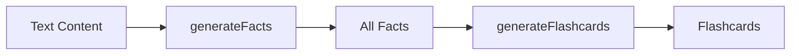

# Fact Scoring Feature Plan

## Overview

Add an intermediate LLM API call between fact extraction and flashcard generation to score and filter facts based on their learning value. This ensures only high-quality, non-obvious, impactful facts become flashcards.

## Current Flow



## New Flow


## Scoring System

### Dimensions (0-3 each)

| Dimension | Description | Weight |
|-----------|-------------|--------|
| Centrality | How essential to the document's main message | **2x** |
| Non-obviousness | Would an informed non-expert already know this? | 1x |
| Leverage | Does it help explain or unlock other ideas? | 1x |
| Testability | Can it become a clear recall-based flashcard? | 1x |
| Transfer | Does it apply beyond a single narrow context? | 1x |

### Score Calculation

```
score_total = (centrality × 2) + non_obviousness + leverage + testability + transfer
```

- **Minimum score**: 0
- **Maximum score**: 18 (6 + 3 + 3 + 3 + 3)
- **Threshold**: > 11 (facts must score 12 or higher to pass)

### Filtering Rules

1. **Single fact exception**: If only 1 fact exists, always pass it regardless of score
2. **Score threshold**: Only facts with `score_total > 11` pass to flashcard generation
3. **Cap at 40**: If more than 40 facts pass the threshold, take only the top 40 by score

## Files to Create/Modify

### New Files

#### `src/lib/gemini/scoreFacts.ts`

New module for fact scoring with the following exports:

```typescript
// Types
export interface FactScore {
  id: string;
  scores: {
    centrality: number;      // 0-3
    non_obviousness: number; // 0-3
    leverage: number;        // 0-3
    testability: number;     // 0-3
    transfer: number;        // 0-3
  };
  score_total: number;       // 0-18
}

export interface ScoredFact extends Fact {
  score?: FactScore;
}

// Main function
export async function scoreFacts(facts: Fact[]): Promise<ScoredFact[]>;

// Filter function
export function filterScoredFacts(scoredFacts: ScoredFact[]): Fact[];
```

**Implementation details:**
- Use Gemini structured output schema (same pattern as generateFacts.ts)
- Fixed prompt (not user-configurable)
- Handle batching if many facts (reuse batching pattern from generateFlashcards.ts)
- Return original facts enriched with scores
- Filter function applies the 3 rules (single fact, threshold > 11, cap at 40)

### Modified Files

#### `src/lib/anki/types.ts`

Add new types for scoring:

```typescript
export interface FactScores {
  centrality: number;
  non_obviousness: number;
  leverage: number;
  testability: number;
  transfer: number;
}

export interface FactScore {
  id: string;
  scores: FactScores;
  score_total: number;
}

export interface ScoredFact extends Fact {
  score?: FactScore;
}
```

#### `src/pages/EntryDetailScreen.tsx`

Update the `handleGenerate` function flow:

1. Add new UI state: `'SCORING_FACTS'` to the `UIState` type
2. Update `handleGenerate()` to:
   - Call `generateFacts()` → get all facts
   - Call `scoreFacts()` → get scored facts
   - Call `filterScoredFacts()` → get filtered high-value facts
   - Call `generateFlashcards()` with filtered facts
3. Update progress/log messages for the new step
4. Handle edge case: if no facts pass filtering, show appropriate error

**State machine update:**

```
READY → GENERATING_FACTS → SCORING_FACTS → GENERATING_CARDS → REVIEW_CARDS
```

#### `src/lib/settings/defaultPrompts.ts`

Add the scoring prompt as a constant (not user-configurable):

```typescript
export const FACT_SCORING_PROMPT = `You are scoring candidate facts...`;
```

## Prompt Details

The full prompt to use (as provided by user):

```
You are scoring candidate facts extracted from a document.

Goal:
Assign a learning-value score to each fact so that the highest-scoring facts represent the most important, non-obvious, high-impact ideas in the document.

Scoring Dimensions:
For each fact, assign a score from 0–3 on each dimension:

- Centrality: How essential is this fact to the document's main message or argument?
- Non-obviousness: Would an informed but non-expert reader already know this?
- Leverage: Does this fact help explain, unlock, or contextualize other ideas?
- Testability: Can this fact be turned into a clear recall-based flashcard with one unambiguous answer?
- Transfer: Does this fact apply beyond a single example or narrow context?

Weighting:
- Multiply Centrality by 2 when computing the total score.

Rules:
- Score each fact independently.
- Do not drop or filter facts.
- Do not rewrite or merge facts.
- Do not add new facts.
- Use the full 0–3 range where appropriate.

Notes:
- Higher scores should reflect facts that would still be worth remembering a month from now.
- Trivial, generic, or obvious facts should receive low scores.
- Big, non-obvious, explanatory ideas should receive high scores.
```

## JSON Schema for Gemini Structured Output

```typescript
const schema: Schema = {
  type: SchemaType.ARRAY,
  items: {
    type: SchemaType.OBJECT,
    properties: {
      id: { type: SchemaType.STRING },
      scores: {
        type: SchemaType.OBJECT,
        properties: {
          centrality: { type: SchemaType.NUMBER },
          non_obviousness: { type: SchemaType.NUMBER },
          leverage: { type: SchemaType.NUMBER },
          testability: { type: SchemaType.NUMBER },
          transfer: { type: SchemaType.NUMBER },
        },
        required: ['centrality', 'non_obviousness', 'leverage', 'testability', 'transfer'],
      },
      score_total: { type: SchemaType.NUMBER },
    },
    required: ['id', 'scores', 'score_total'],
  },
};
```

## Edge Cases

1. **Empty facts array**: Skip scoring, return empty array
2. **Single fact**: Always pass to flashcard generation regardless of score
3. **All facts score ≤ 11**: Show error message that no high-value facts were found
4. **More than 40 facts pass**: Sort by score_total descending, take top 40
5. **API failure during scoring**: Log error, fail gracefully with error message
6. **Fact ID mismatch**: Match scores back to facts by ID, skip facts without matching scores

## Implementation Order

1. Add types to `src/lib/anki/types.ts`
2. Add prompt constant to `src/lib/settings/defaultPrompts.ts`
3. Create `src/lib/gemini/scoreFacts.ts` with scoring and filtering logic
4. Update `src/pages/EntryDetailScreen.tsx` to integrate the new step
5. Test end-to-end flow
6. Create documentation in `docs/fact-scoring-feature.md`

## Testing Considerations

- Test with 0 facts (empty input)
- Test with 1 fact (should always pass)
- Test with facts that all score low (should show error)
- Test with > 40 high-scoring facts (should cap at 40)
- Test with mixed scores (verify correct filtering)
- Test with large documents (verify batching works)
