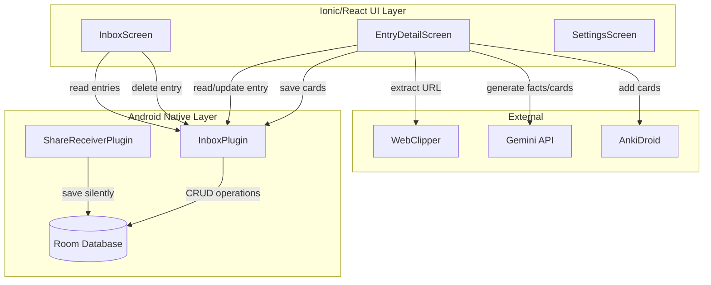
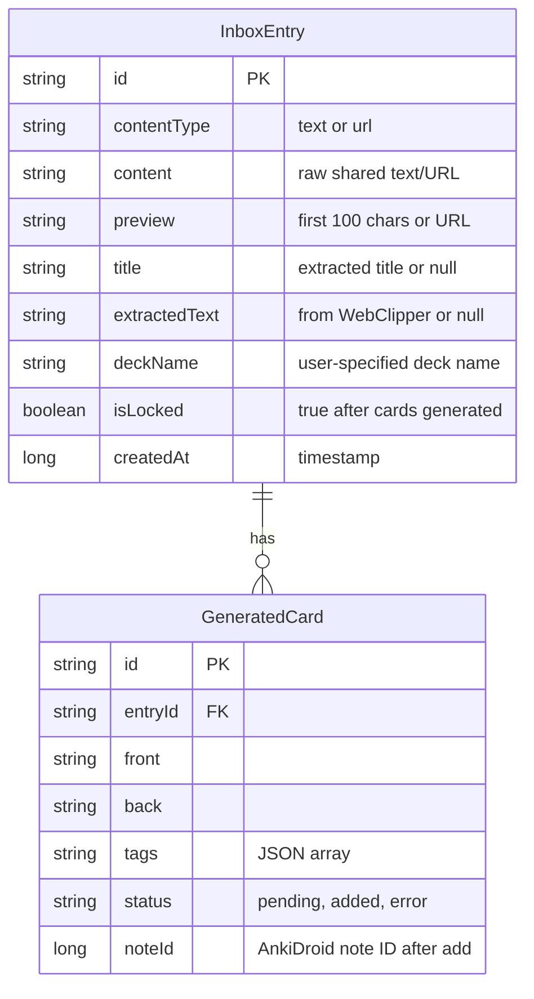
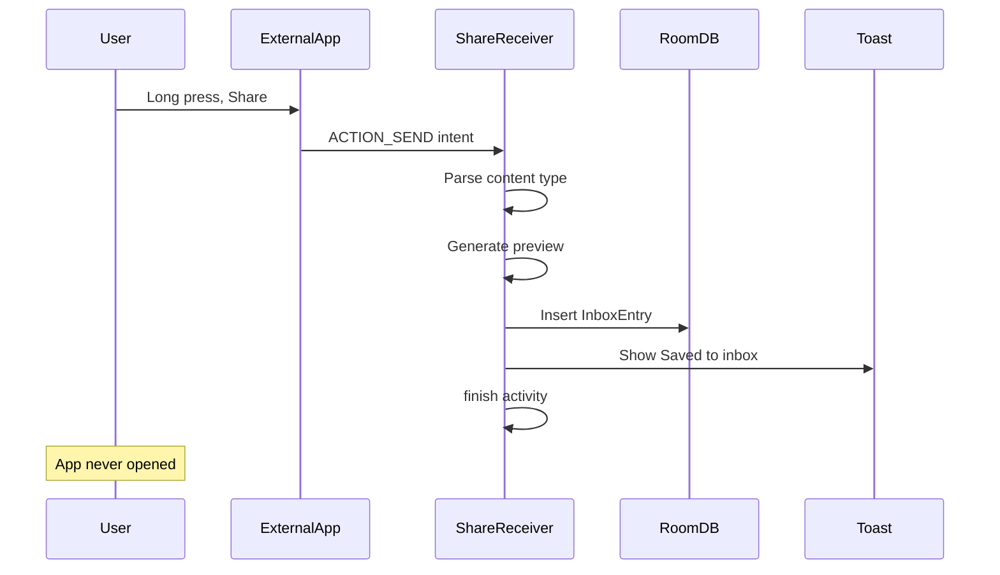
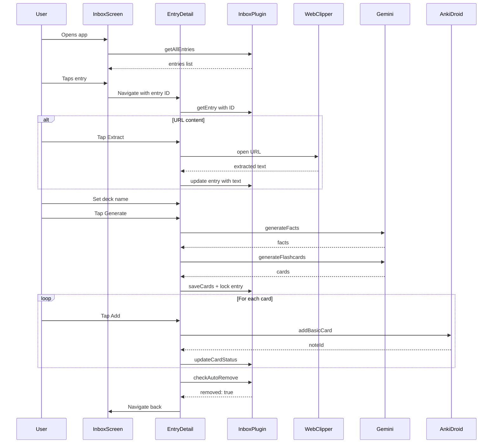

# Inbox Architecture Plan

## Overview

Transform MasterFlasher from a single-share flow to an inbox-based architecture where shared content is silently saved for later processing. The inbox becomes the main screen, and each entry can be independently processed into flashcards.

## Current vs New Flow

### Current Flow
```
Share → App Opens → ImportScreen → Generate Cards → Add to Anki → Done
```

### New Flow
```
Share → Silent Save + Toast → App stays closed
         ↓
User Opens App → InboxScreen (list of entries)
         ↓
Tap Entry → EntryDetailScreen → Set Deck Name → Generate Cards → Review → Add to Anki
         ↓
All cards added → Entry auto-removed
```

## Architecture Diagram



## Database Schema



## Component Architecture

### New Files to Create

#### Android/Java - Database Layer
| File | Purpose |
|------|---------|
| `InboxEntry.java` | Room entity for inbox entries |
| `GeneratedCard.java` | Room entity for flashcards |
| `InboxDao.java` | Data Access Object interface |
| `AppDatabase.java` | Room database class |
| `InboxPlugin.java` | Capacitor plugin exposing DB to JS |

#### TypeScript - Plugin Interface
| File | Purpose |
|------|---------|
| `src/plugins/Inbox.ts` | TypeScript interface for InboxPlugin |
| `src/lib/inbox/types.ts` | TypeScript types for inbox data |

#### React - UI Components
| File | Purpose |
|------|---------|
| `src/pages/InboxScreen.tsx` | Main screen showing inbox list |
| `src/pages/EntryDetailScreen.tsx` | Card generation and review for single entry |

### Files to Modify
| File | Changes |
|------|---------|
| `android/app/build.gradle` | Add Room dependencies |
| `ShareReceiverPlugin.java` | Silent save to DB + toast notification |
| `MainActivity.java` | Register InboxPlugin |
| `AndroidManifest.xml` | Add activity for silent share handling |
| `src/App.tsx` | New routing with inbox as default |

## Detailed Implementation

### Phase 1: Android Database Layer

#### 1.1 Add Room Dependencies
```gradle
// android/app/build.gradle
dependencies {
    // Room
    def room_version = "2.6.1"
    implementation "androidx.room:room-runtime:$room_version"
    annotationProcessor "androidx.room:room-compiler:$room_version"
}
```

#### 1.2 InboxEntry Entity
```java
@Entity(tableName = "inbox_entries")
public class InboxEntry {
    @PrimaryKey
    @NonNull
    public String id;
    
    public String contentType; // "text" or "url"
    public String content;     // raw shared content
    public String preview;     // truncated for display
    public String title;       // extracted title (nullable)
    public String extractedText; // from WebClipper (nullable)
    public String deckName;    // user-specified (nullable until set)
    public boolean isLocked;   // true after card generation
    public long createdAt;
}
```

#### 1.3 GeneratedCard Entity
```java
@Entity(tableName = "generated_cards",
        foreignKeys = @ForeignKey(
            entity = InboxEntry.class,
            parentColumns = "id",
            childColumns = "entryId",
            onDelete = ForeignKey.CASCADE
        ))
public class GeneratedCard {
    @PrimaryKey
    @NonNull
    public String id;
    
    public String entryId;
    public String front;
    public String back;
    public String tags;    // JSON array string
    public String status;  // "pending", "added", "error"
    public Long noteId;    // AnkiDroid note ID after successful add
}
```

#### 1.4 InboxDao Interface
```java
@Dao
public interface InboxDao {
    // Entries
    @Query("SELECT * FROM inbox_entries ORDER BY createdAt DESC")
    List<InboxEntry> getAllEntries();
    
    @Query("SELECT * FROM inbox_entries WHERE id = :id")
    InboxEntry getEntry(String id);
    
    @Insert(onConflict = OnConflictStrategy.REPLACE)
    void insertEntry(InboxEntry entry);
    
    @Update
    void updateEntry(InboxEntry entry);
    
    @Query("DELETE FROM inbox_entries WHERE id = :id")
    void deleteEntry(String id);
    
    // Cards
    @Query("SELECT * FROM generated_cards WHERE entryId = :entryId")
    List<GeneratedCard> getCardsForEntry(String entryId);
    
    @Insert(onConflict = OnConflictStrategy.REPLACE)
    void insertCards(List<GeneratedCard> cards);
    
    @Update
    void updateCard(GeneratedCard card);
    
    @Query("SELECT COUNT(*) FROM generated_cards WHERE entryId = :entryId AND status != 'added'")
    int getPendingCardCount(String entryId);
}
```

### Phase 2: Capacitor Plugin

#### 2.1 InboxPlugin.java
Exposes database operations to the Ionic UI:
- `getAllEntries()` - Returns all inbox entries as JSON array
- `getEntry(id)` - Returns single entry with its cards
- `saveEntry(entry)` - Creates/updates an entry
- `deleteEntry(id)` - Deletes entry (cascades to cards)
- `saveCards(entryId, cards)` - Saves generated cards for entry
- `updateCardStatus(cardId, status, noteId)` - Marks card as added
- `checkAutoRemove(entryId)` - Removes entry if all cards added

#### 2.2 TypeScript Interface
```typescript
// src/plugins/Inbox.ts
export interface InboxEntry {
    id: string;
    contentType: 'text' | 'url';
    content: string;
    preview: string;
    title?: string;
    extractedText?: string;
    deckName?: string;
    isLocked: boolean;
    createdAt: number;
}

export interface GeneratedCard {
    id: string;
    entryId: string;
    front: string;
    back: string;
    tags: string[];
    status: 'pending' | 'added' | 'error';
    noteId?: number;
}

export interface InboxPlugin {
    getAllEntries(): Promise<{ entries: InboxEntry[] }>;
    getEntry(options: { id: string }): Promise<{ entry: InboxEntry; cards: GeneratedCard[] }>;
    saveEntry(options: { entry: InboxEntry }): Promise<void>;
    deleteEntry(options: { id: string }): Promise<void>;
    saveCards(options: { entryId: string; cards: GeneratedCard[] }): Promise<void>;
    updateCardStatus(options: { cardId: string; status: string; noteId?: number }): Promise<void>;
    checkAutoRemove(options: { entryId: string }): Promise<{ removed: boolean }>;
}
```

### Phase 3: Silent Share Handling

#### 3.1 Modify ShareReceiverPlugin
Instead of notifying the UI, the plugin:
1. Generates a UUID for the entry
2. Determines content type (text vs URL)
3. Creates a preview (first 100 chars or URL)
4. Saves to Room database
5. Shows a toast: "Saved to inbox"
6. Finishes the activity (app stays closed)

#### 3.2 Share Activity Configuration
```xml
<!-- AndroidManifest.xml - new activity for background share -->
<activity
    android:name=".plugins.ShareReceiverActivity"
    android:theme="@android:style/Theme.Translucent.NoTitleBar"
    android:launchMode="singleTask"
    android:taskAffinity=""
    android:excludeFromRecents="true"
    android:exported="true">
    
    <intent-filter>
        <action android:name="android.intent.action.SEND" />
        <category android:name="android.intent.category.DEFAULT" />
        <data android:mimeType="text/plain" />
    </intent-filter>
</activity>
```

### Phase 4: UI Components

#### 4.1 InboxScreen
Main screen showing list of inbox entries:
- Pull-to-refresh to reload entries
- Each item shows: preview, content type icon, timestamp, lock status
- Swipe-to-delete or delete button
- Tap to navigate to EntryDetailScreen
- Empty state when no entries

#### 4.2 EntryDetailScreen
Processing flow for a single entry:
1. **Initial State**: Shows content preview, deck name input
2. **URL Flow**: "Extract Content" button → WebClipper → show extracted text
3. **Generate**: "Generate Cards" button → Gemini API → lock entry
4. **Review**: List of cards with Add button for each
5. **Auto-remove**: When all cards added, navigate back and entry is gone

### Phase 5: Routing Updates

```typescript
// src/App.tsx
const App: React.FC = () => (
  <IonApp>
    <IonReactRouter>
      <IonRouterOutlet>
        <Route exact path="/inbox">
          <InboxScreen />
        </Route>
        <Route exact path="/entry/:id">
          <EntryDetailScreen />
        </Route>
        <Route exact path="/settings">
          <SettingsScreen />
        </Route>
        <Route exact path="/">
          <Redirect to="/inbox" />
        </Route>
      </IonRouterOutlet>
    </IonReactRouter>
  </IonApp>
);
```

## Data Flow Diagrams

### Share Flow


### Card Generation Flow


## Edge Cases and Considerations

### Error Handling
- **Share fails to save**: Show error toast, do not close activity
- **Card generation fails**: Show error, allow retry, do NOT lock entry
- **AnkiDroid not available**: Show error on card add, card stays "pending"
- **Entry deleted mid-generation**: Cards are cascade-deleted by Room

### State Persistence
- App can be killed at any point; all state is in Room DB
- Cards persist across app restarts until added or deleted
- Locked entries cannot regenerate cards (must delete and re-share)

### Migration from Old Flow
- Remove [`ImportScreen.tsx`](src/pages/ImportScreen.tsx:1) entirely
- Users who had pending shares lose them (acceptable for v1)
- No database migration needed (new tables)

## Testing Checklist
- [ ] Share text → saves silently with toast
- [ ] Share URL → saves silently with toast
- [ ] Open app → inbox shows entries sorted by date
- [ ] Tap text entry → can set deck name and generate
- [ ] Tap URL entry → can extract, then generate
- [ ] Delete entry → entry and cards removed
- [ ] Add all cards → entry auto-removed
- [ ] Kill app mid-flow → state preserved
- [ ] API key not set → prompted before generation

## File Summary

### New Files (14)
```
android/app/src/main/java/com/snortstudios/masterflasher/
├── db/
│   ├── AppDatabase.java
│   ├── InboxEntry.java
│   ├── GeneratedCard.java
│   └── InboxDao.java
└── plugins/
    ├── InboxPlugin.java
    └── ShareReceiverActivity.java

src/
├── plugins/
│   └── Inbox.ts
├── lib/inbox/
│   └── types.ts
└── pages/
    ├── InboxScreen.tsx
    └── EntryDetailScreen.tsx

docs/
└── inbox-feature.md
```

### Modified Files (6)
```
android/app/build.gradle          - Room dependencies
android/app/src/main/AndroidManifest.xml - Share activity
MainActivity.java                 - Register InboxPlugin
ShareReceiverPlugin.java          - Silent save logic (or deprecate)
src/App.tsx                       - New routing
README.md                         - Updated documentation
```

### Deleted Files (1)
```
src/pages/ImportScreen.tsx        - Replaced by InboxScreen + EntryDetailScreen
```
