# PDF Sharing Feature - Implementation Plan

## Overview

Add the ability to share PDF files to MasterFlasher, extract text content using pdf.js, and generate flashcards from the extracted content. This follows the same manual extraction pattern as URL content extraction.

**Key Design Decision**: Instead of using a custom plugin with base64 encoding, we copy the PDF to a location accessible via Capacitor's file URL scheme, allowing pdf.js to load it directly. This is simpler, safer, and avoids memory issues with large PDFs.

## Architecture Diagram

```mermaid
flowchart TD
    subgraph Share Flow
        A[User shares PDF from any app] --> B[ShareReceiverActivity]
        B --> C{MIME type?}
        C -->|text/plain| D[Existing text/url flow]
        C -->|application/pdf| E[Copy PDF to public app storage - background thread]
        E --> F[Save entry with contentType=pdf and capacitor URL]
        F --> G[Toast: Saved to inbox]
    end

    subgraph Extraction Flow
        H[User opens PDF entry] --> I[EntryDetailScreen]
        I --> J[Show Extract Text from PDF button]
        J --> K[User clicks Extract]
        K --> L[pdf.js loads PDF via Capacitor URL]
        L --> M[Extract text from all pages]
        M --> N[Clean up text - fix hyphenation and whitespace]
        N --> O[Save extractedText to database]
        O --> P[Proceed to card generation]
    end
```



## Component Changes

### 1. Android Native Layer

#### AndroidManifest.xml
Add PDF MIME type to ShareReceiverActivity with separate intent-filter for clarity:
```xml
<!-- Existing text/plain share receiver -->
<intent-filter>
    <action android:name="android.intent.action.SEND" />
    <category android:name="android.intent.category.DEFAULT" />
    <data android:mimeType="text/plain" />
</intent-filter>

<!-- PDF share receiver -->
<intent-filter>
    <action android:name="android.intent.action.SEND" />
    <category android:name="android.intent.category.DEFAULT" />
    <data android:mimeType="application/pdf" />
</intent-filter>
```

#### file_paths.xml (Update)
Add path for PDF storage that Capacitor can access:
```xml
<files-path name="pdfs" path="pdfs/" />
```

#### ShareReceiverActivity.java
- Handle `ACTION_SEND` with `application/pdf` MIME type
- Extract PDF URI from `Intent.EXTRA_STREAM`
- **Copy PDF on background thread** using AsyncTask or Executor
- Copy to `getFilesDir()/pdfs/pdf_{uuid}.pdf`
- Store the **Capacitor-compatible file URL** in `content` field
- Save entry with `contentType = "pdf"` and `content = capacitor://localhost/_capacitor_file_/data/.../pdfs/pdf_{uuid}.pdf`

**No custom plugin needed!** The file is accessible directly via Capacitor's file URL scheme.

### 2. TypeScript/Web Layer

#### package.json
Add dependency:
```json
"pdfjs-dist": "^5.4.449"
```

#### src/lib/pdf/extractPdfText.ts (New)
PDF text extraction using pdf.js with URL loading:
```typescript
import * as pdfjsLib from 'pdfjs-dist';
import pdfjsWorker from 'pdfjs-dist/build/pdf.worker.mjs?url';

// Configure worker properly for Vite
pdfjsLib.GlobalWorkerOptions.workerSrc = pdfjsWorker;

export async function extractPdfText(pdfUrl: string): Promise<string> {
    const pdf = await pdfjsLib.getDocument(pdfUrl).promise;
    const textParts: string[] = [];
    
    for (let i = 1; i <= pdf.numPages; i++) {
        const page = await pdf.getPage(i);
        const textContent = await page.getTextContent();
        const pageText = textContent.items
            .map((item: any) => item.str)
            .join(' ');
        textParts.push(pageText);
    }
    
    const rawText = textParts.join('\n\n');
    return cleanExtractedText(rawText);
}

/**
 * Clean up common PDF text extraction artifacts
 */
function cleanExtractedText(text: string): string {
    return text
        // Fix hyphenated line breaks: "hy-\nphen" → "hyphen"
        .replace(/(\w)-\n(\w)/g, '$1$2')
        // Normalize multiple spaces to single space
        .replace(/[ \t]+/g, ' ')
        // Normalize multiple newlines to double newline
        .replace(/\n{3,}/g, '\n\n')
        // Trim whitespace from each line
        .split('\n')
        .map(line => line.trim())
        .join('\n')
        // Final trim
        .trim();
}
```

### 3. Database Layer

#### InboxEntry.java
Update contentType documentation to include "pdf":
```java
/**
 * Content type: "text", "url", or "pdf"
 */
public String contentType;

/**
 * Raw shared content:
 * - For text: the actual text
 * - For url: the URL string
 * - For pdf: Capacitor-compatible file URL
 */
public String content;
```

#### src/plugins/Inbox.ts
Update type:
```typescript
export interface InboxEntry {
    id: string;
    contentType: 'text' | 'url' | 'pdf';
    content: string;  // For pdf: Capacitor file URL
    // ... rest unchanged
}
```

### 4. UI Layer

#### EntryDetailScreen.tsx
Add PDF extraction handling:
```typescript
import { extractPdfText } from '../lib/pdf/extractPdfText';

const needsPdfExtraction = entry?.contentType === 'pdf' && !entry.extractedText;

const handlePdfExtract = async () => {
    if (!entry) return;
    
    try {
        setState('EXTRACTING');
        setLog('Extracting text from PDF...');
        
        // pdf.js loads the file directly via the Capacitor URL
        const extractedText = await extractPdfText(entry.content);
        
        // Save to database
        await Inbox.updateExtractedContent({
            entryId: entry.id,
            title: `PDF: ${entry.preview}`,
            extractedText
        });
        
        setEntry({ ...entry, extractedText });
        setLog(`Extracted ${extractedText.length} characters`);
        setState('READY');
    } catch (e) {
        console.error('PDF extraction failed:', e);
        setErrorMsg('PDF extraction failed. The file may be password-protected or image-only.');
        setState('ERROR');
    }
};

// In render:
{needsPdfExtraction && (
    <IonCard>
        <IonCardContent>
            <IonButton expand="block" onClick={handlePdfExtract}>
                <IonIcon slot="start" icon={documentTextOutline} />
                Extract Text from PDF
            </IonButton>
        </IonCardContent>
    </IonCard>
)}
```

#### InboxScreen.tsx
Show PDF-specific icon:
```typescript
import { documentOutline, linkOutline, documentTextOutline } from 'ionicons/icons';

<IonIcon
    icon={entry.contentType === 'pdf' ? documentOutline :
          entry.contentType === 'url' ? linkOutline :
          documentTextOutline}
/>
```

## Data Flow

### Share Flow
1. User shares PDF → Android receives `ACTION_SEND` with `application/pdf`
2. `ShareReceiverActivity` extracts URI from `EXTRA_STREAM`
3. **On background thread**: Copy file to `{app_files_dir}/pdfs/pdf_{uuid}.pdf`
4. Create `InboxEntry` with:
   - `contentType = "pdf"`
   - `content = "capacitor://localhost/_capacitor_file_/data/.../pdfs/pdf_{uuid}.pdf"`
   - `preview = "PDF: {original_filename}"`
5. Save to Room database
6. Show toast, finish activity

### Extraction Flow
1. User taps PDF entry → `EntryDetailScreen` loads
2. Shows "Extract Text from PDF" button (since `extractedText` is null)
3. User taps button → `handlePdfExtract()` called
4. pdf.js loads PDF directly via Capacitor URL (no plugin needed!)
5. Extract text from all pages
6. Clean up text (fix hyphenation, normalize whitespace)
7. Call `Inbox.updateExtractedContent({ entryId, extractedText })`
8. UI updates, now shows content preview and "Generate Cards" button

## File Structure Changes

```
src/
├── lib/
│   └── pdf/
│       └── extractPdfText.ts      # NEW: pdf.js text extraction + cleanup
├── plugins/
│   └── Inbox.ts                   # UPDATE: Add pdf type
├── pages/
│   ├── EntryDetailScreen.tsx      # UPDATE: PDF extraction UI
│   └── InboxScreen.tsx            # UPDATE: PDF icon
android/app/src/main/
├── java/.../
│   ├── plugins/
│   │   └── ShareReceiverActivity.java # UPDATE: Handle PDF + background copy
│   └── db/
│       └── InboxEntry.java        # UPDATE: Document pdf contentType
├── res/xml/
│   └── file_paths.xml             # UPDATE: Add pdfs path
└── AndroidManifest.xml            # UPDATE: PDF MIME type
```

**Note**: No new native plugin required! This is a simpler design.

## Edge Cases

| Scenario | Handling |
|----------|----------|
| Large PDF (>10MB) | pdf.js loads via URL (no memory issue). May take time to extract - show progress. |
| Password-protected PDF | pdf.js will fail; show error message suggesting to use an unprotected PDF |
| Scanned PDF (images only) | pdf.js extracts no/little text; show message that OCR is not supported |
| PDF extraction fails | Show error toast, allow retry. Entry remains with contentType=pdf |
| App uninstalled | PDF files in app storage are automatically deleted by Android |
| Entry deleted | PDF file should be deleted via cleanup logic in InboxPlugin.deleteEntry |
| Share during app killed | File copy on background thread completes even if activity finishes |

## Cleanup Considerations

When an entry with `contentType = "pdf"` is deleted:
1. Parse the file path from the Capacitor URL
2. Delete the PDF file from app storage
3. Delete the database entry (cascade deletes cards)

Update `InboxPlugin.deleteEntry()`:
```java
@PluginMethod
public void deleteEntry(PluginCall call) {
    String id = call.getString("id");
    // ...
    
    try {
        InboxEntry entry = getDao().getEntry(id);
        if (entry != null && "pdf".equals(entry.contentType)) {
            // Delete the PDF file
            String filePath = extractFilePathFromCapacitorUrl(entry.content);
            File pdfFile = new File(filePath);
            if (pdfFile.exists()) {
                pdfFile.delete();
            }
        }
        
        getDao().deleteEntry(id);
        call.resolve();
    } catch (Exception e) {
        call.reject("Failed to delete entry: " + e.getMessage(), e);
    }
}
```

## Testing Checklist

- [ ] Share PDF from Files app → saved to inbox
- [ ] Share PDF from Gmail attachment → saved to inbox
- [ ] Share PDF from Chrome download → saved to inbox
- [ ] Open PDF entry → shows extraction button
- [ ] Extract text → text appears in preview (hyphenation fixed, clean whitespace)
- [ ] Generate cards from PDF text → cards created
- [ ] Delete PDF entry → file removed from storage
- [ ] Handle password-protected PDF → graceful error
- [ ] Handle image-only PDF → appropriate message (little/no text extracted)
- [ ] Share large PDF (>10MB) → works without memory issues

## Dependencies

### New npm Package
```bash
npm install pdfjs-dist
```

### pdf.js Worker Configuration
Using Vite's `?url` import for proper worker setup:

```typescript
import * as pdfjsLib from 'pdfjs-dist';
import pdfjsWorker from 'pdfjs-dist/build/pdf.worker.mjs?url';

// This is the reliable way to configure the worker in Vite
pdfjsLib.GlobalWorkerOptions.workerSrc = pdfjsWorker;
```

**Important**: Do NOT set `workerSrc = ''` as this breaks pdf.js.
