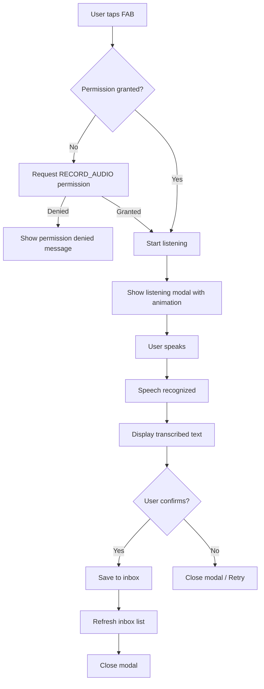

# Speech Recognition Feature Plan

## Purpose

Add the ability for users to speak text that they want to add to the inbox using the microphone. This provides an alternative to sharing content from other apps - users can directly dictate text within the MasterFlasher app.

## User Experience

### UI Design
- **Floating Action Button (FAB)**: A microphone icon FAB positioned at the bottom-right corner of the InboxScreen
- **Listening Modal**: When tapped, shows a modal with visual feedback indicating the app is listening
- **Confirmation**: After speech is recognized, shows the transcribed text with options to save or cancel

### Flow


## Technical Implementation

### Dependencies
- `@capacitor-community/speech-recognition` - Capacitor plugin for speech-to-text

### Files to Create/Modify

| File | Action | Description |
|------|--------|-------------|
| `package.json` | Modify | Add speech-recognition dependency |
| `android/app/src/main/AndroidManifest.xml` | Modify | Add RECORD_AUDIO permission |
| `src/plugins/SpeechRecognition.ts` | Create | TypeScript wrapper for the plugin |
| `src/hooks/useSpeechRecognition.ts` | Create | Custom React hook for speech recognition logic |
| `src/pages/InboxScreen.tsx` | Modify | Add FAB and listening modal |
| `docs/speech-recognition.md` | Create | Feature documentation |

### Android Manifest Changes

```xml
<!-- Add to AndroidManifest.xml -->
<uses-permission android:name="android.permission.RECORD_AUDIO" />
```

### Plugin Wrapper (src/plugins/SpeechRecognition.ts)

```typescript
import { SpeechRecognition as SpeechRecognitionPlugin } from '@capacitor-community/speech-recognition';

export interface SpeechRecognitionResult {
  matches: string[];
}

export const SpeechRecognition = {
  /**
   * Check if speech recognition is available on the device
   */
  available: () => SpeechRecognitionPlugin.available(),
  
  /**
   * Request microphone permission
   */
  requestPermissions: () => SpeechRecognitionPlugin.requestPermissions(),
  
  /**
   * Check current permission status
   */
  checkPermissions: () => SpeechRecognitionPlugin.checkPermissions(),
  
  /**
   * Start listening for speech
   */
  start: (options?: { language?: string; popup?: boolean; partialResults?: boolean }) => 
    SpeechRecognitionPlugin.start(options),
  
  /**
   * Stop listening
   */
  stop: () => SpeechRecognitionPlugin.stop(),
  
  /**
   * Check if currently listening
   */
  isListening: () => SpeechRecognitionPlugin.isListening(),
  
  /**
   * Add listener for partial results
   */
  addListener: SpeechRecognitionPlugin.addListener.bind(SpeechRecognitionPlugin),
  
  /**
   * Remove all listeners
   */
  removeAllListeners: () => SpeechRecognitionPlugin.removeAllListeners(),
};

export default SpeechRecognition;
```

### Custom Hook (src/hooks/useSpeechRecognition.ts)

The hook will encapsulate:
- Permission management
- Listening state
- Error handling
- Partial results handling
- Cleanup on unmount

Key states:
- `isAvailable: boolean` - Whether device supports speech recognition
- `isListening: boolean` - Whether currently listening
- `transcript: string` - Current recognized text
- `error: string | null` - Any error message
- `permissionStatus: 'granted' | 'denied' | 'prompt'`

Key methods:
- `startListening()` - Begin speech recognition
- `stopListening()` - Stop speech recognition
- `requestPermission()` - Request microphone permission

### InboxScreen.tsx Modifications

1. **Import FAB components from Ionic**:
   - `IonFab`, `IonFabButton`, `IonModal`

2. **Add FAB with microphone icon**:
   ```tsx
   <IonFab vertical="bottom" horizontal="end" slot="fixed">
     <IonFabButton onClick={handleStartSpeech}>
       <IonIcon icon={micOutline} />
     </IonFabButton>
   </IonFab>
   ```

3. **Add listening modal with states**:
   - Listening animation/indicator
   - Recognized text display
   - Stop/Cancel/Save buttons

4. **Save flow**:
   - Create new InboxEntry with `contentType: 'text'`
   - Use `Inbox.saveEntry()` to persist
   - Call `loadEntries()` to refresh the list

### Entry Structure for Speech Input

```typescript
const entry: InboxEntry = {
  id: crypto.randomUUID(),
  contentType: 'text',
  content: transcribedText,
  preview: transcribedText.substring(0, 100),
  isLocked: false,
  createdAt: Date.now(),
};
```

## Edge Cases and Error Handling

| Scenario | Handling |
|----------|----------|
| Permission denied | Show toast explaining why permission is needed |
| Speech recognition unavailable | Hide FAB or show disabled state with tooltip |
| No speech detected | Allow retry or manual text input fallback |
| Network error on Android | Some Android devices require internet for speech recognition - show appropriate error |
| User cancels mid-speech | Clean up listeners and reset state |

## Testing Considerations

1. Test on physical Android device (emulators have limited microphone support)
2. Test permission flow - first time grant, denial, and re-request
3. Test with various languages if supporting multi-language
4. Test long-form speech and short phrases
5. Test cancellation during listening
6. Verify entry appears in inbox after save

## Future Enhancements (Out of Scope)

- Support for multiple languages in settings
- Continuous listening mode for longer dictation
- Speech-to-text for specific fields in EntryDetailScreen
- Voice commands for navigation
