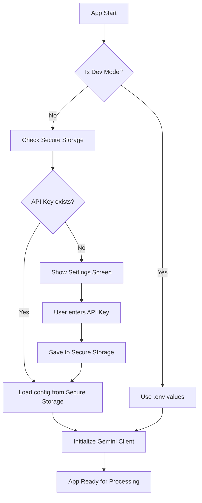
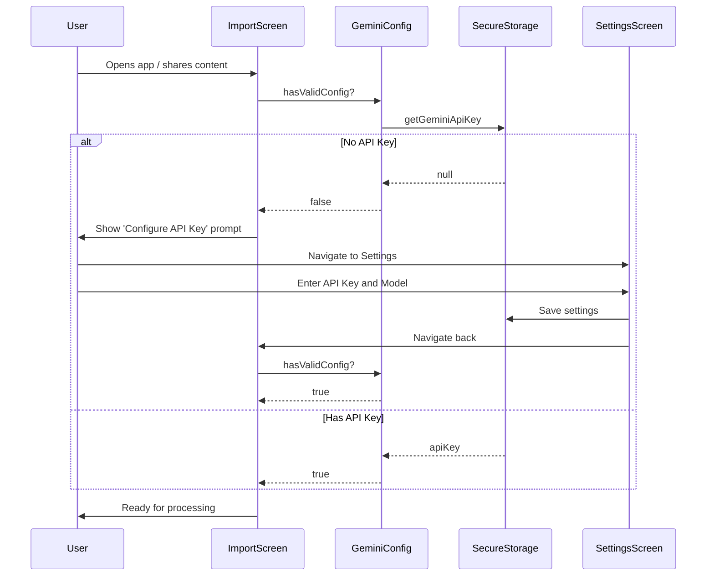

# User API Key Settings Feature

## Purpose

Enable users to provide their own Gemini API key and optionally specify a Gemini model, stored securely using `capacitor-secure-storage-plugin`. This allows the app to work without bundling an API key in production builds.

## Behavior

- **Development mode**: Use `.env` file values (`VITE_GEMINI_API_KEY`, `VITE_GEMINI_MODEL_NAME`)
- **Production mode**: Use secure storage for user-provided keys only
- **Default model**: `gemini-2.5-flash-lite` if no model is specified by user

## Architecture



## Key Files

### New Files

| File | Description |
|------|-------------|
| [`src/lib/settings/secureStorage.ts`](src/lib/settings/secureStorage.ts) | Wrapper around capacitor-secure-storage-plugin with typed methods |
| [`src/lib/settings/geminiConfig.ts`](src/lib/settings/geminiConfig.ts) | Service to resolve API key and model from secure storage or env |
| [`src/pages/SettingsScreen.tsx`](src/pages/SettingsScreen.tsx) | UI for entering API key and model selection |

### Modified Files

| File | Changes |
|------|---------|
| [`package.json`](package.json) | Add capacitor-secure-storage-plugin dependency |
| [`src/lib/gemini/generateFacts.ts`](src/lib/gemini/generateFacts.ts:5) | Refactor to use async config service instead of module-level constants |
| [`src/lib/gemini/generateFlashcards.ts`](src/lib/gemini/generateFlashcards.ts:6) | Refactor to use async config service instead of module-level constants |
| [`src/App.tsx`](src/App.tsx:28) | Add /settings route |
| [`src/pages/ImportScreen.tsx`](src/pages/ImportScreen.tsx:46) | Add settings button and handle missing API key state |

## Implementation Details

### 1. Secure Storage Service

```typescript
// src/lib/settings/secureStorage.ts
import { SecureStoragePlugin } from 'capacitor-secure-storage-plugin';

const KEYS = {
  GEMINI_API_KEY: 'gemini_api_key',
  GEMINI_MODEL: 'gemini_model',
} as const;

export async function getGeminiApiKey(): Promise<string | null> {
  try {
    const result = await SecureStoragePlugin.get({ key: KEYS.GEMINI_API_KEY });
    return result.value;
  } catch {
    return null;
  }
}

export async function setGeminiApiKey(value: string): Promise<boolean> {
  try {
    await SecureStoragePlugin.set({ key: KEYS.GEMINI_API_KEY, value });
    return true;
  } catch {
    return false;
  }
}

export async function getGeminiModel(): Promise<string | null> {
  try {
    const result = await SecureStoragePlugin.get({ key: KEYS.GEMINI_MODEL });
    return result.value;
  } catch {
    return null;
  }
}

export async function setGeminiModel(value: string): Promise<boolean> {
  try {
    await SecureStoragePlugin.set({ key: KEYS.GEMINI_MODEL, value });
    return true;
  } catch {
    return false;
  }
}

export async function clearGeminiSettings(): Promise<void> {
  try {
    await SecureStoragePlugin.remove({ key: KEYS.GEMINI_API_KEY });
    await SecureStoragePlugin.remove({ key: KEYS.GEMINI_MODEL });
  } catch {
    // Ignore errors on clear
  }
}
```

### 2. Gemini Configuration Service

```typescript
// src/lib/settings/geminiConfig.ts
import { getGeminiApiKey, getGeminiModel } from './secureStorage';

const DEFAULT_MODEL = 'gemini-2.5-flash-lite';

export interface GeminiConfig {
  apiKey: string;
  modelName: string;
}

export async function getGeminiConfig(): Promise<GeminiConfig | null> {
  // In development mode, use env variables
  if (import.meta.env.DEV) {
    const apiKey = import.meta.env.VITE_GEMINI_API_KEY;
    const modelName = import.meta.env.VITE_GEMINI_MODEL_NAME || DEFAULT_MODEL;
    
    if (apiKey) {
      return { apiKey, modelName };
    }
  }
  
  // In production, use secure storage
  const apiKey = await getGeminiApiKey();
  if (!apiKey) {
    return null; // Signal that settings need to be configured
  }
  
  const modelName = (await getGeminiModel()) || DEFAULT_MODEL;
  return { apiKey, modelName };
}

export async function hasValidConfig(): Promise<boolean> {
  const config = await getGeminiConfig();
  return config !== null;
}
```

### 3. Refactored Gemini Modules

The key change is moving from module-level initialization to lazy initialization:

```typescript
// src/lib/gemini/generateFacts.ts
import { GoogleGenerativeAI } from '@google/generative-ai';
import { getGeminiConfig } from '../settings/geminiConfig';

// Remove module-level constants
// const API_KEY = import.meta.env.VITE_GEMINI_API_KEY;
// const MODEL_NAME = import.meta.env.VITE_GEMINI_MODEL_NAME;
// const genAI = new GoogleGenerativeAI(API_KEY);

async function getModel() {
  const config = await getGeminiConfig();
  if (!config) {
    throw new Error('Gemini API Key not configured. Please set your API key in Settings.');
  }
  
  const genAI = new GoogleGenerativeAI(config.apiKey);
  return genAI.getGenerativeModel({
    model: config.modelName,
    generationConfig: {
      responseMimeType: 'application/json',
      responseSchema: schema,
      maxOutputTokens: 8192,
    },
  });
}

// Update verifyAndGenerateFacts to use getModel()
async function verifyAndGenerateFacts(text: string, title?: string): Promise<Fact[]> {
  const model = await getModel(); // Changed from genAI.getGenerativeModel()
  // ... rest of function
}
```

### 4. Settings Screen UI

The settings screen will include:
- API Key input field with secure text entry
- Model name input with default value shown
- Save button
- Clear settings button
- Validation feedback

### 5. ImportScreen Changes

- Add a settings gear icon in the header
- Check for API key configuration on load
- Show a prompt/redirect to settings if no API key is configured

## User Flow



## Dependencies

```json
{
  "dependencies": {
    "capacitor-secure-storage-plugin": "^0.10.0"
  }
}
```

After installation, run:
```bash
npx cap sync android
```

## Edge Cases

1. **Storage access fails**: Fall back gracefully, show error message to user
2. **Invalid API key**: Gemini API will return an error - surface this in the UI with option to update settings
3. **Model not found**: If user specifies an invalid model, Gemini API will error - allow retry with different model
4. **Development vs Production detection**: Use `import.meta.env.DEV` which Vite provides

## Testing Checklist

- [ ] Settings can be saved and retrieved
- [ ] App prompts for API key on first launch in production
- [ ] Default model is applied when none specified
- [ ] Settings persist across app restarts
- [ ] Clear settings works correctly
- [ ] Development mode still uses .env values
- [ ] Invalid API key shows appropriate error message
